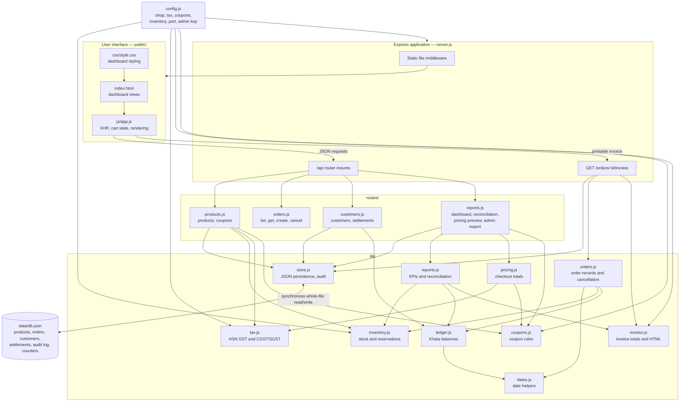
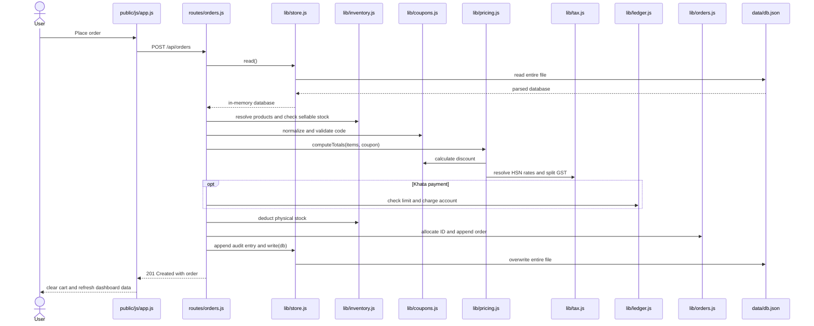

# ShopLedger architecture

This diagram records the application as it exists on `main`. It does not show proposed components.

```mermaid
flowchart TB
  subgraph Browser["User interface — public/"]
    HTML["index.html<br/>dashboard views"]
    JS["js/app.js<br/>XHR, cart state, rendering"]
    CSS["css/style.css<br/>dashboard styling"]
    HTML --> JS
    CSS --> HTML
  end

  subgraph Server["Express application — server.js"]
    Static["Static file middleware"]
    API["/api router mounts"]
    InvoiceRoute["GET /orders/:id/invoice"]
  end

  subgraph Routes["routes/"]
    ProductRoutes["products.js<br/>products, coupons"]
    OrderRoutes["orders.js<br/>list, get, create, cancel"]
    CustomerRoutes["customers.js<br/>customers, settlements"]
    ReportRoutes["reports.js<br/>dashboard, reconciliation,<br/>pricing preview, admin export"]
  end

  subgraph Lib["lib/"]
    Store["store.js<br/>JSON persistence, audit"]
    Orders["orders.js<br/>order records and cancellation"]
    Inventory["inventory.js<br/>stock and reservations"]
    Pricing["pricing.js<br/>checkout totals"]
    Tax["tax.js<br/>HSN GST and CGST/SGST"]
    Coupons["coupons.js<br/>coupon rules"]
    Ledger["ledger.js<br/>Khata balances"]
    Dates["dates.js<br/>date helpers"]
    Invoice["invoice.js<br/>invoice totals and HTML"]
    Reports["reports.js<br/>KPIs and reconciliation"]
  end

  Config["config.js<br/>shop, tax, coupons,<br/>inventory, port, admin key"]
  DB[("data/db.json<br/>products, orders, customers,<br/>settlements, audit log, counters")]

  JS -->|"JSON requests"| API
  JS -->|"printable invoice"| InvoiceRoute
  Static --> Browser
  API --> ProductRoutes
  API --> OrderRoutes
  API --> CustomerRoutes
  API --> ReportRoutes

  ProductRoutes --> Store
  ProductRoutes --> Inventory
  ProductRoutes --> Tax
  ProductRoutes --> Coupons

  CustomerRoutes --> Store
  CustomerRoutes --> Ledger

  ReportRoutes --> Store
  ReportRoutes --> Reports
  ReportRoutes --> Pricing
  ReportRoutes --> Coupons

  InvoiceRoute --> Store
  InvoiceRoute --> Orders
  InvoiceRoute --> Invoice

  Store <-->|"synchronous whole-file read/write"| DB
  Orders --> Dates
  Orders --> Inventory
  Orders --> Ledger
  Pricing --> Tax
  Pricing --> Coupons
  Ledger --> Dates
  Reports --> Inventory
  Reports --> Ledger
  Reports --> Invoice

  Config --> Inventory
  Config --> Tax
  Config --> Coupons
  Config --> Invoice
  Config --> Server
```
## Order flow

```mermaid
sequenceDiagram
  actor User
  participant UI as public/js/app.js
  participant Route as routes/orders.js
  participant Store as lib/store.js
  participant Inventory as lib/inventory.js
  participant Coupons as lib/coupons.js
  participant Pricing as lib/pricing.js
  participant Tax as lib/tax.js
  participant Ledger as lib/ledger.js
  participant Orders as lib/orders.js
  participant DB as data/db.json

  User->>UI: Place order
  UI->>Route: POST /api/orders
  Route->>Store: read()
  Store->>DB: read entire file
  DB-->>Store: parsed database
  Store-->>Route: in-memory database
  Route->>Inventory: resolve products and check sellable stock
  Route->>Coupons: normalize and validate code
  Route->>Pricing: computeTotals(items, coupon)
  Pricing->>Coupons: calculate discount
  Pricing->>Tax: resolve HSN rates and split GST
  opt Khata payment
    Route->>Ledger: check limit and charge account
  end
  Route->>Inventory: deduct physical stock
  Route->>Orders: allocate ID and append order
  Route->>Store: append audit entry and write(db)
  Store->>DB: overwrite entire file
  Route-->>UI: 201 Created with order
  UI-->>User: clear cart and refresh dashboard data
```
